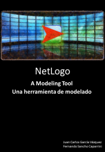

# NetLogo: A Modeling Tool / Una herramienta de modelado

Examples from the Book / Ejemplos del libro

You can find more infomation about the book [here](https://payhip.com/b/VhKb).

Puedes encontrar más información sobre el libro [aquí](https://payhip.com/b/VhKb).

In this repository you can find some of the complete examples from the book. Please contact the authors (fsanchocaparrini@gmail.com) if you hace any comments or suggestion.

En este repositorio puedes encontrar algunos de los ejemplos completos del libro. Las versiones que se muestran son las asociadas a la versión inglesa del libro. Please contact the authors (fsanchocaparrini@gmail.com) if you hace any comments or suggestion.
